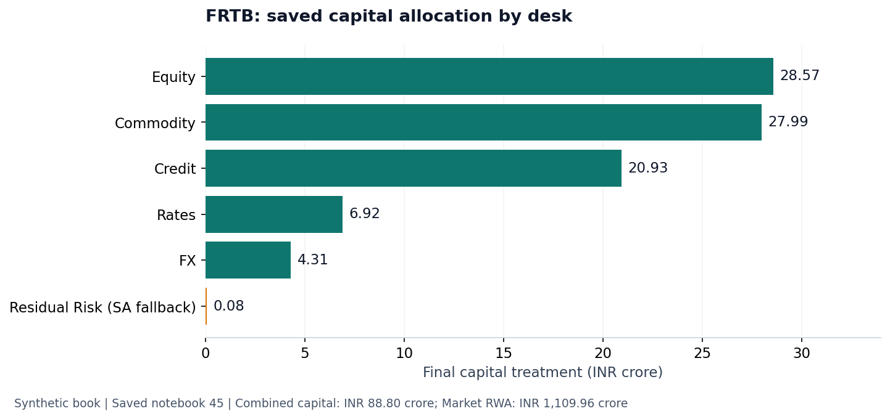

# FRTB Market Risk Engine

This Python project calculates Basel Fundamental Review of the Trading Book market-risk capital under both the Standardised Approach and the Internal Models Approach using one shared synthetic trading book.

## Saved results

The saved synthetic run combines eligible IMA desks with an SA fallback desk. All amounts below are INR crore, rounded from the reproduced calculation and notebooks 28 and 45, with valuation date 30 June 2026.

| Capital component | Saved result |
|---|---:|
| Full-book SA capital (comparison) | 109.50 |
| Eligible IMA before amber surcharge | 88.72 |
| Amber surcharge | 0.00 |
| SA fallback | 0.08 |
| Combined market-risk capital | 88.80 |
| Market RWA | 1,109.96 |

Market RWA is calculated as 12.5 times unrounded combined capital. Five desks are IMA green; the Residual Risk desk uses SA fallback. These synthetic outcomes do not demonstrate supervisory eligibility for a real trading desk.



## Explore the analysis

[Start: shared trading book and SA map](notebooks/00_project_scope_and_architecture.ipynb) · [IMA calculation map](notebooks/30_ima_complete_calculation_map.ipynb) · [Final capital and Market RWA](notebooks/45_combined_sa_ima_capital_and_market_rwa.ipynb)

Read the saved notebooks and preview without installing Python. The detailed Excel reporting workbook is generated locally by the commands below; it is not included in the Git source tree. The full-book SA comparison and desk-level standalone SA amounts are distinct from the aggregate fallback amount.

## Complete calculation boundary

```text
Shared trading book and INR market data
                 |
       Pricing and risk factors
          /                \
Standardised Approach   Internal Models Approach
SBM + SA DRC + RRAO     RFET -> MRF / NMRF
                       MRF -> ES -> IMCC
                       NMRF -> SES
                       Default risk -> IMA DRC
                       PLA + backtesting -> desk eligibility
          \                /
       IMA eligible desks + SA fallback desks
                 |
      Final FRTB market-risk capital
                 |
              x 12.5
                 |
             Market RWA
```

INR is the reporting currency. Foreign positions retain their native currency and generate the relevant FX exposure against INR.

## Data and regulatory parameters

- The 48 trades, valuation market snapshot, ten-year factor history, RFET observations and 501 position dates are explicitly labelled synthetic. The position dates produce 500 prior-day-to-next-day P&L outcomes.
- Synthetic history is generated from correlated economic drivers, volatility clustering, named stress regimes and fixed random seeds.
- RFET records represent synthetic transaction and committed-quote events; they are not public closing prices.
- Basel parameters are stored separately under `config/regulatory/basel_2026_08_25/` with source lineage to MAR20–MAR23 and MAR30–MAR33.
- Every completed calculation retains factor, desk, trade, date and scenario detail.

## Chronological notebooks

The 47 pre-executed notebooks form one continuous calculation.

The sequence begins with the [SA calculation map](notebooks/00_project_scope_and_architecture.ipynb), continues through the [IMA calculation map](notebooks/30_ima_complete_calculation_map.ipynb), and ends with [combined capital and Market RWA](notebooks/45_combined_sa_ima_capital_and_market_rwa.ipynb). The [notebook curriculum](docs/notebook_curriculum.md) lists every stage.

- `00`–`05`: trading book, market data, pricing and factor mapping
- `06`–`17`: delta, exact-factor netting, vega and curvature by risk class and derivatives portfolio
- `18`–`22`: weights, correlations and seven-class SBM
- `23`–`29`: SA DRC, RRAO, SA capital and trade walkthrough
- `30`–`38`: IMA map, RFET, liquidity horizons, historical P&L, ES, IMCC and NMRF SES
- `39`–`44`: IMA DRC, daily portfolios, HPL/RTPL, PLA, VaR backtesting, eligibility and IMA aggregation
- `45`–`46`: combined SA/IMA capital, Market RWA, reporting and lineage

Each notebook states the calculation, purpose, inputs, formula, numerical example and interpretation. Monetary displays use INR or INR crore without scientific notation.

## Reproducible execution

Python 3.11 or later is required; automated checks use Python 3.12. From the cloned repository:

```bash
python scripts/bootstrap_environment.py
```

Activate the created environment, then use the same commands on each platform:

```bash
# macOS / Linux
source .frtb_sa_env/bin/activate
# Windows Command Prompt: .frtb_sa_env\Scripts\activate
# Windows PowerShell: .frtb_sa_env\Scripts\Activate.ps1
python -m frtb_engine validate-foundation
python -m frtb_engine run-ima
python scripts/build_notebooks.py
python scripts/build_ima_notebooks.py
python scripts/validate_notebooks.py
python scripts/build_report.py
python -m pytest -q
```

The macOS launcher `Run FRTB Market Risk Engine.command` runs the integrated calculation and opens retained outputs. Tests create missing integration outputs on a fresh checkout. The automated workflow runs the foundation checks, integrated calculation tests and saved-notebook checks.

## Project structure

- `data/synthetic/` — shared trades, market snapshot and generated IMA history
- `config/regulatory/` — Basel parameters and source lineage
- `src/frtb_engine/pricing.py` — common transparent valuation functions
- `src/frtb_engine/sensitivities.py` — common trade-to-factor mapping and repricing sensitivities
- `src/frtb_engine/sbm.py`, `drc.py`, `rrao.py` — Standardised Approach calculations
- `src/frtb_engine/ima.py` — RFET, ES, IMCC, SES, IMA DRC, PLA and backtesting calculations
- `src/frtb_engine/ima_pipeline.py` — desk eligibility, SA fallback and combined capital
- `docs/` — calculation methodology, scope, architecture, data definitions and notebook sequence
- `notebooks/` — 47 pre-executed chronological notebooks
- `tests/` — formula, regulatory-control, lineage and end-to-end tests
- `outputs/` — generated run artifacts and a formula-driven reporting workbook

## Interpretation boundary

The engine is a Basel-aligned educational implementation using synthetic data and transparent pricing approximations. It is not a bank-approved internal model, an RBI filing or evidence of supervisory model approval.

The 60-day capital comparison is reconstructed using the current portfolio and stress calibration across dated observation windows. It illustrates the averaging formula; it is not a record of capital calculated on each day's historical holdings.

## Related projects

[IFRS 9 ECL](https://github.com/keyurmarolia/ifrs9-mortgage-ecl) · [Basel credit capital](https://github.com/keyurmarolia/basel-credit-capital-engine) · [Momentum research](https://github.com/keyurmarolia/momentum-in-indian-equities-research) · [InterGlobe valuation](https://github.com/keyurmarolia/interglobe-aviation-equity-research-model)
